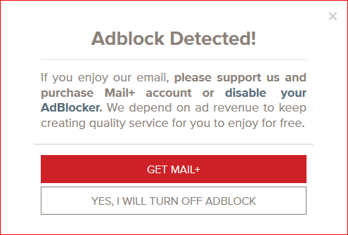
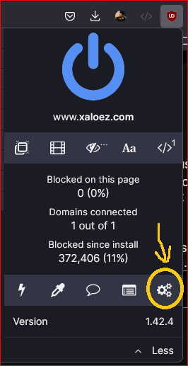
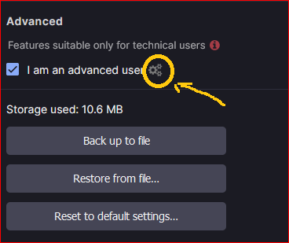
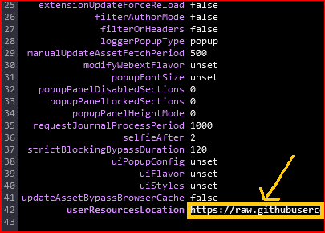
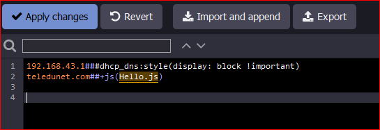

# uBlock

The purpose of this repository is to:

-   Host additional files such as custom filter rules for uBlock extension.

-   Not to loose custom filter rules that were created over time when reinstalling the operating system.

-   Having the same custom filter rules applied on different browsers or different operating systems with just a single URL.

#### Custom filters

-   Block annoying random divisions in page if uBlock has been detected.

Ex: A random div message



The fix is to block the div that starts with a specific prefix and then fix the window scrollbar \#### Adding custom filter rules to uBlock

Click the icon of uBlock and then click on gears icon.

`Settings -> Filter Lists -> Custom -> Import`

To get the **URL** from GitHub repository click on the file that you wish to add and then select **RAW** then copy and paste the URL from the browsers address bar into uBlock textbox.

### Javascript Injection

To be able to inject Javascript in pages you need to follow the steps below.

1. Go to **Main menu** and click on the gears.



2. Go to **Advanced settings** in **Advanced** section and click the gears.



3. Find the **userResourcesLocation** and replace unset with the URL file of the javascript that you wish to inject.



4. Then the last step is to go to **My Filters** and set the following command `sitename##+js(ScriptName.js)` yes without quotes.



The javascript file can contain multiple sections but each section should not have empty rows.

``` javascript
///ScriptName.js 
console.log("Hello!");
function x(var1) {
  console.log(var1);
};
x("ABC");
 
///OtherScript.js 
console.log("Another snippet!");
```


